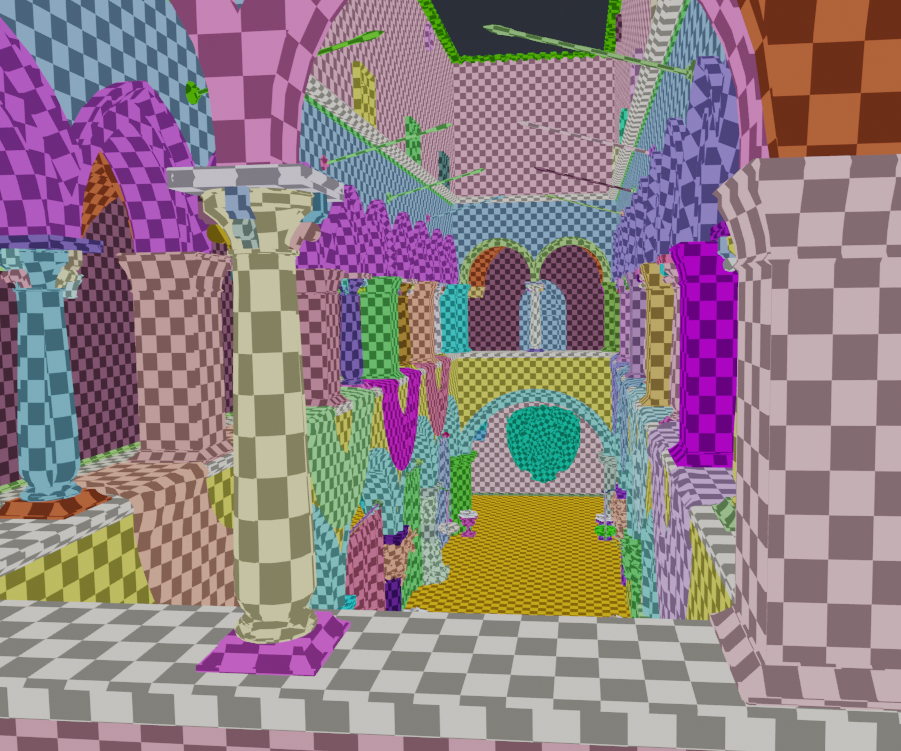
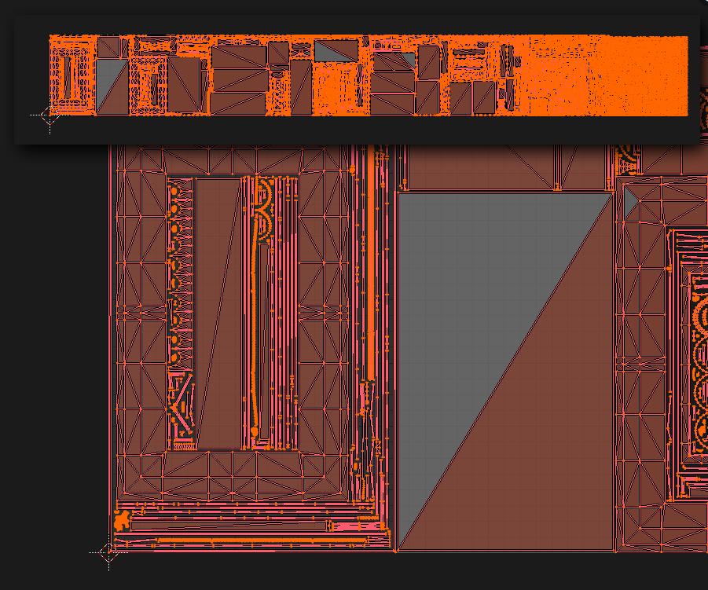
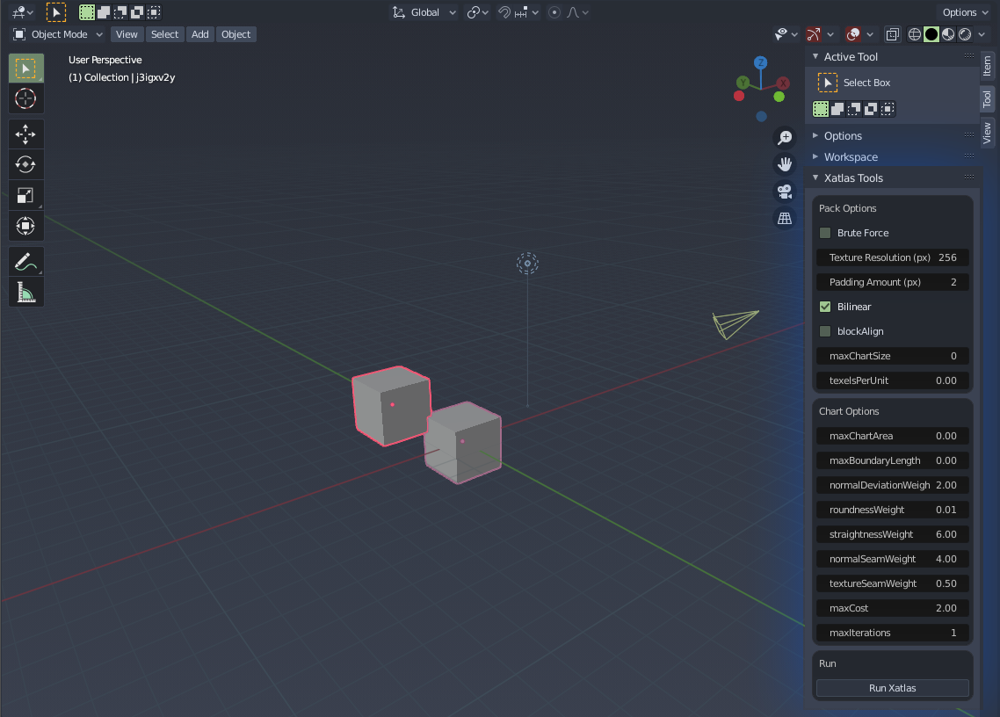

# blender-xatlas

I'm so sorry. This is not good. I have no idea what I'm doing.  

This is a rough add-on for Blender allowing you to use Xatlas to unwrap and pack your uvs  
It currently works on Windows/Linux (Tested on Windows 10, Windows 8, Ubuntu)  
Code in /xatlas_src is modified from [xatlas](https://github.com/jpcy/xatlas/)  

<p float="left">


</p>


## Usage

### Install
1. Add ```./addons/blender-xatlas``` to you Blender addons folder, or download the .zip in releases and install in Blender [Preferences -> Add-ons -> Install... ]
2. Once enabled it will appear under the Xatlas option in 3D View sidebar (Default open with 'n')


### Use
Warning! The tool will make a single user copy and triangulate your mesh (Unless using 'Pack Only')

1. Make sure you file is saved
2. Change your settings under Xatlas Tools
3. Select the objects you wish to unwrap and unpack
4. Click ```Run Xatlas```
5. Wait for an undetermined period
6. Hopefully your unwrapped uvs should appear

## Xatlas
### Build (Windows vs2017)
1. Run ```./bin/premake.bat```
2. Open ```./build/vs2017/xatlas.sln```
3. Build
4. The Output file should be copied to ```./addons/blender-xatlas/xatlas``` automatically

### Edit Addon
```xatlas-blender.cpp```

## Status

